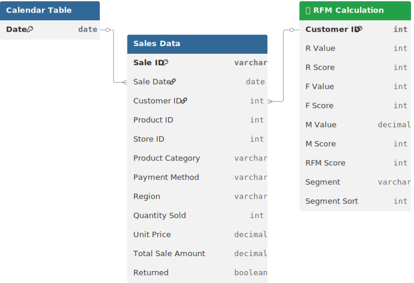

# 📊 Project Background: End-to-End Retail Analytics for Omniretail

**Omniretail Pvt Ltd** is a dynamic retail conglomerate operating across the electronics, clothing, home & kitchen, and grocery sectors. As the company scales its operations across four major African regions (North, South, East, West), the leadership team is grappling with **"Profitless Growth"**, revenue is rising, but operational inefficiencies and customer churn are eroding margins.

This project leverages a robust dataset of **500 transaction records** (representing a sample of **$18.5 Million** in revenue) to diagnose the health of the retail ecosystem. As a Lead Retail Analyst, my objective was to move beyond simple sales reporting to uncover the **"Regional Fractures"** and **"Retention Voids"** threatening long-term sustainability. The analysis serves as a strategic playbook for the C-Suite to transition from a "Spray-and-Pray" expansion model to a **Precision-Retail** strategy.

Insights and recommendations are provided on the following key areas:

* **The Regional Divide** (West's Dominance vs. North's Decline)
* **The "Return" Crisis** (Plugging Value Leakage in High-Ticket Categories)
* **The Loyalty Vacuum** (Addressing the <20% Customer Retention Rate)
* **Category Dynamics** (Stabilizing Grocery & Accelerating Home/Toys)

https://github.com/user-attachments/assets/f6d184b6-e4a3-4319-bf6d-5166aaab931d

**PowerQuery M Code regarding data preparation process of various tables can be found [[here]](https://github.com/mehedibhai101/End-to-End_Retail_Business_Analytics/tree/main/Data%20Cleaning).**

**DAX queries regarding various analytical calculations can be found [[here]](https://github.com/mehedibhai101/End-to-End_Retail_Business_Analytics/tree/main/DAX%20Calculations).**

**An interactive Power BI dashboard used to report and explore sales trends can be found [[here]](https://app.powerbi.com/view?r=eyJrIjoiNjMwNWU3NGUtMTY2MS00ZjI1LThlY2YtODNmYTI1ZjBiZGNlIiwidCI6IjAwMGY1Mjk5LWU2YTUtNDYxNi1hNTI4LWJjZTNlNGUyYjk4ZCIsImMiOjEwfQ%3D%3D).**

---

# 🏗️ Data Structure & Initial Checks

The analysis is powered by a comprehensive transaction dataset (`OmniRetail.csv`) containing **500 records**, capturing the full lifecycle of retail operations from sale to return.

* **`Sale_ID` & `Sale_Date**`: Primary keys used to track transaction velocity and temporal trends.
* **`Customer_ID`**: The unique identifier used to measure the **Retention Rate** and calculate Customer Lifetime Value (CLV).
* **`Product_ID` & `Product_Category**`: Segmenting performance across **Electronics, Grocery, Clothing, Toys, and Home**.
* **`Store_ID` & `Region**`: Geographic attributes identifying the **North, South, East, and West** sales hubs.
* **`Quantity_Sold` & `Unit_Price**`: Core financial metrics (Unit Price is currently standardized at **$200.59** across the board).
* **`Payment_Method`**: Tracking the adoption of **Credit Card, Cash, UPI, and Net Banking** across different regions.
* **`Returned`**: A binary indicator (Yes/No) used to isolate "Value Leakage" and calculate the **10% overall return rate**.
* **`Total_Sale_Amount`**: The derived revenue metric representing the final transaction value.

### 🗺️ Entity Relationship Diagram (ERD)


---

# 📋 Executive Summary

### Overview of Findings

Omniretail is currently a **"Tale of Two Businesses."** While the **West Region** is a powerhouse driving significant revenue, the **North** is facing a dangerous profitability decline, and the **East** remains stagnant. The most alarming metric is the **Customer Retention Rate (<20%)**, indicating that the business is churning customers faster than it can acquire them. Furthermore, while overall returns are stable, specific categories like **Electronics and Clothing** are bleeding value through high return rates, requiring immediate operational intervention.

---

# 🔍 Insights Deep Dive

### 🌏 The Regional Divide (The "West Side Story")

* **The Western Powerhouse.** The **West Region** has emerged as the undisputed growth engine, contributing the highest share of the **$18.5M** total revenue. It outperforms all other regions in both transaction volume and average ticket size.
* **The Northern Bleed.** The **North Region** is showing signs of distress with declining profitability metrics. Despite operational costs remaining high, sales velocity has slowed, suggesting a disconnect between inventory mix and local demand.
* **Eastern Stagnation.** The **East Region** is stuck in a "Volatile Demand" cycle. Sales are unpredictable, making inventory planning difficult and leading to either stockouts or overstock situations.


### 📉 The "Return" Crisis (Value Leakage)

* **High-Ticket Vulnerability.** While the overall return rate sits at a manageable **10%**, the damage is concentrated in high-value categories. **Electronics** and **Clothing** show return rates significantly above the average.
* **The "Fit & Function" Friction.** The high return rate in Clothing suggests issues with sizing consistency or product description accuracy online. In Electronics, returns are likely driven by complex setup processes or "defect-on-arrival" perceptions.


### 🧲 The Loyalty Vacuum (Retention <20%)

* **The One-and-Done Problem.** Data reveals a critical **Retention Rate of less than 20%**. The vast majority of customers make a single purchase and never return, indicating a failure in post-purchase engagement.
* **The "Silent" High-Value Customer.** A small segment of customers exhibits high spending with **zero returns**. These are our "Ideal Profiles," yet there is no dedicated program to lock them in.
* **Acquisition Dependency.** The business is heavily reliant on constantly acquiring new traffic to maintain revenue, which is a significantly more expensive strategy than retaining existing shoppers.


### 🛒 Category Dynamics & Payment Shifts

* **Grocery Stability vs. Growth Stars.** **Grocery** remains the top category by volume, acting as the "traffic driver" for the business. However, **Home** and **Toys** are identified as high-potential growth categories that are currently under-marketed.
* **Payment Friction.** Payment preferences are shifting unevenly across regions. While the West is adopting digital payments rapidly, other regions still rely heavily on Cash/Debit, creating friction at checkout and limiting data capture.
* **The "Basket Builder" Opportunity.** The strong traffic in Grocery is not being leveraged to cross-sell into higher-margin categories like Home or Toys.


---

# 🚀 Recommendations:

* **The "Northern Revitalization" Plan:** Immediately audit the product mix in the **North Region**. Shift inventory away from slow-moving Electronics towards high-velocity Grocery and Home essentials to stabilize cash flow.
* **"Fit-First" Initiative:** To tackle the Clothing return crisis, implement a "True-Fit" sizing guide online and a stricter quality control check for Electronics suppliers. Target a **15% reduction in returns** within 6 months.
* **Launch "Omni-Prime" Loyalty:** addressing the <20% retention is critical. Launch a tiered loyalty program rewarding frequency over volume. Offer **"Free Next-Day Delivery"** to repeat buyers to lock in the Grocery segment.
* **Cross-Pollination Strategy:** Use the high-traffic Grocery category as a "Trojan Horse." Print **20% Off Coupons for Toys/Home** on every Grocery receipt to drive cross-category adoption.
* **Regional Payment Optimization:** In the cash-heavy East/North, incentivize digital payments with a **"5% Cashback on Digital Wallet"** promo to improve checkout speed and customer data capture.

---

## ⚠️ Assumptions and Caveats:

Throughout the analysis, the following strategic assumptions were made to address specific data architecture challenges identified during the audit:

* **Uniform Pricing Structure:** All products within the dataset currently share an identical Unit Price ($200.59). For this analysis, it is assumed that revenue variance is driven strictly by volume and regional sales velocity rather than price elasticity.
* **Flat Regional Hierarchy:** The data lacks a direct Region-to-Store hierarchy (e.g., the same Store ID appearing in multiple regions). Analysis assumes regional assignments in the fact table are the "Source of Truth" for geographic performance.
* **Product ID Granularity:** Some unique products share the same ID in the source system. Analysis treats these as category-level aggregations to maintain data integrity across the dashboard.
* **Retention Calculation:** Due to a lack of historical acquisition dates, retention is calculated as a percentage of unique Customer IDs appearing in more than one transaction cycle within the current window.

---

## 📂 Repository Structure

```
End-to-End_Retail_Business_Analytics/
│
├── Dashboard/                            # Final visualization and reporting outputs
│   ├── assets/                           # Visual elements used in reports (logos, icons, etc.)
│   │   ├── Icons/                        # Collection of icons used in KPI Cards/Buttons
│   │   ├── Templates/                    # Company logo and background templates of the dashboard
│   │   └── Theme.json                    # Custom Power BI color palette for dashboard
│   ├── live_dashboard.md                 # Links to hosted Power BI Service report
│   └── static_overview.pdf               # Exported PDF version of the final dashboard for quick viewing
│
├── Data Cleaning/                        # ETL process and Power Query transformations
│   ├── calendar_table.m                  # M-script for generating a dynamic Calendar table
│   └── sales_table.m                     # M-script for cleaning and transforming raw sales records
│
├── Dataset/                              # The data foundation of the project
│   ├── entity_relationship_diagram.svg   # Visual map of table connections and cardinality
│   └── Sales_Data.csv                    # The primary raw data source containing transaction history
│
├── DAX Calculations/                     # Business logic and analytical formulas
│   ├── calculated_column.md              # Definitions for static row-level logic
│   └── measures.md                       # Dynamic aggregation formulas (e.g., Total Revenue, MoM Growth)
│
├── LICENSE                               # Legal terms for code and data usage
└── README.md                             # Project background, summary and key insights
``` 

---

## 🛡️ License

This project is licensed under the [MIT License](LICENSE). You are free to use, modify, and distribute it with proper attribution.

---

## 🌟 About Me

Hi! I’m **Mehedi Hasan**, well known as **Mehedi Bhai**, a Certified Data Analyst with strong proficiency in *Excel*, *Power BI*, and *SQL*. I specialize in data visualization, transforming raw data into clear, meaningful insights that help businesses make impactful data-driven decisions.

Let’s connect:

[](https://www.linkedin.com/in/mehedi-hasan-b3370130a/)
[](https://youtube.com/@mehedibro101?si=huk7eZ05dOwHTs1-)
